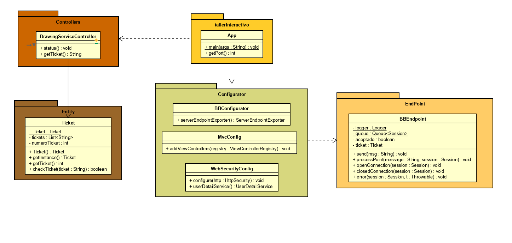

# Daniel Felipe Alfonso Bueno 

# Profesor: Luis Daniel Benavides
# ARSW - Arquitectura de Software 2020-I
## Descripción

En este proyecto se busca asegurar un WebSocket, mediante la implementación de un Ticket el cual solo será otorgado a las personas que se autentiquen en la aplicación, este Ticket será confirmado al momento de enviar mensajes. Además de administrar las sesiones en redis, por si se cae el servidor cuando se restablezca este pueda responder exitosamente a una sesión ya iniciada.
 
[¡Link de la aplicación desplegada en Heroku!](https://polar-bastion-28499.herokuapp.com/index.html)
## Prerrequisitos
Instalación de JAVA 8 y Maven, manejo de Maven como administrador proyectos y librerías y JAVA OO
## Diseño
#### Diagrama de componentes

#### Diagrama de clases

### Descripción
Contamos con una clase principal App la cual es la encargada de ejecutar, nuestra aplicación esta usa un DrawingServiceController donde se harán las peticiones http para obtener los recursos del servidor en el backend, esta misma clase es la encargada de devolver el ticket solicitado por el cliente y validando su existencia en cache. La clase principal también usa un configurator el cual se encarga de la administración del Web socket, también el manejo de rutas y configuración de autenticación de usuarios y este configurador usa un endpoint donde el web socket recibe la información maneja el envió de mensajes, inicio y cierre de conexión también se hace la solicitud y verificación del Ticket. Usamos redis para almacenar la sesión y hacer lo mas stateless posible nuestra aplicación, es decir no almacenar nada en memoria, si no persistir las sesiones. 
## Uso del proyecto
Clonamos el proyecto desde el siguiente link con el comando o ingresamos directamente el link en heroku 
 
~~~
https://github.com/DanielAlfonso17/ARSWLAB8.git
~~~

Podemos ejecutarlo desde mvn o desde una IDE de la siguiente manera 

Accedemos a la aplicación con los usuarios user y user2 con las contraseña password

Iniciamos sesión y podemos observar que el tablero es interactivo el socket  tambien esta protegido, esto podemos probarlo corriendo una nueva instancia de nuestro tablero que no tenga autenticación y podremos comprobar que lo que hagamos en dicho tablero no se actualizara en nuestro tablero original donde estan los dos usuarios. 

